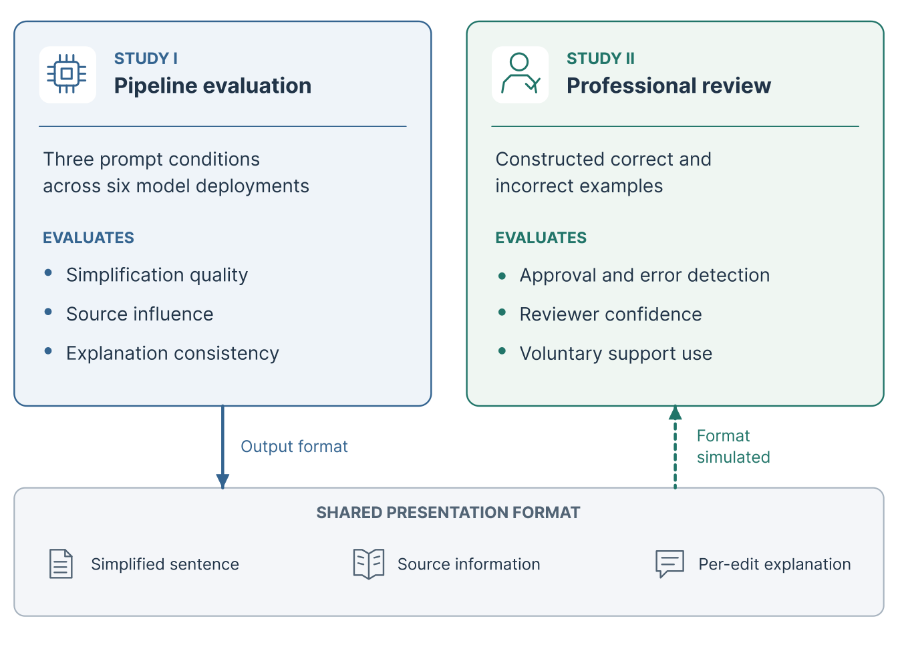

# Evaluating the Role of Context Attributions and Rationales in Building Trust in Clinical Note Simplification

Code, data and results of my Master's thesis (M.Sc. Computer Science, Quality & Usability Lab,
Technische Universität Berlin, 2026).

Clinical notes are written for professionals. LLMs can rewrite them in plain language, but a fluent
rewrite can still change a clinical fact. The thesis examines two steps of a source-supported
simplification workflow:

| | Question | Folder |
|---|---|---|
| **Study I** – pipeline evaluation | Do a difficult-term list and retrieved definitions improve LLM simplification, and do the definitions measurably influence individual replacements? | [`Study_I`](Study_I) |
| **Study II** – professional review | Do healthcare professionals detect and reject incorrect rewrites when source passages and explanations are available? | [`Study_II`](Study_II) |

<p align="center">
  <br>
  <sub>The studies share the presentation format, not data: Study II uses constructed examples with known errors, not Study I outputs.</sub>
</p>

## Try it

- **Pipeline demo (MedPlain):** https://huggingface.co/spaces/xota1999/MedPlain
- **User study:** https://jatos.mindprobe.eu/publix/8PkhiTe7yVz – type `klp` (outside a text field)
  to show a *Skip screen* button and click through the questions.

## The studies in brief

**Study I.** Six LLMs (Qwen3.5-9B, Muse Glimmer 30B, Qwen3.7-Plus, Nemotron 3 Ultra, DeepSeek V4 Pro,
Ternary Bonsai 27B) simplified 100 clinical sentences from the public Laymaker dataset under three
prompts: the sentence only (*naive*), with a list of difficult terms (*termonly*), and with the same
list plus definitions retrieved from nine local lexical resources (*grounded*). ContextCite estimated
how the supplied definitions influenced each replacement, and every attributed edit received an
explanation that was audited against the facts given to the explanation model.

- The term list raised the coverage of terms that clinicians also changed by 19.9–42.7 percentage points.
- Definitions measurably influenced some replacement wording, but no grounded–termonly difference in
  editing coverage, readability, NLI faithfulness/completeness or high-risk edit checks remained
  significant after correction for multiple comparisons.

**Study II.** 42 healthcare professionals (34 in the primary analysis) reviewed eight constructed
rewrites in English, German or Albanian. Each rewrite was shown with highlights only (A), with source
passages (B), and with sources, word-familiarity scores and explanations (C). Four rewrites contained
a planted error.

- 50.0% of the decisions on incorrect rewrites approved them for patient use; 83.8% of these unsafe
  approvals were made with high confidence.
- Opening the error-relevant support was associated with detection, yet nearly half of the unsafe
  approvals happened after that support had been opened.

Neither study measured patient understanding. The code is a research prototype, not a clinical tool.

## Repository

```
Study_I/    pipeline code, knowledge-base files and the saved outputs of the reported run
Study_II/   JATOS study, anonymised responses and analysis scripts
docs/       figure shown in this README
```

## Citation

Xhon Taraj. *Evaluating the Role of Context Attributions and Rationales in Building Trust in Clinical
Note Simplification.* Master's thesis, Technische Universität Berlin, 2026.
Supervisors: Prof. Dr. Sebastian Möller, Prof. Dr. Axel Küpper, Dr. Nils Feldhus.
