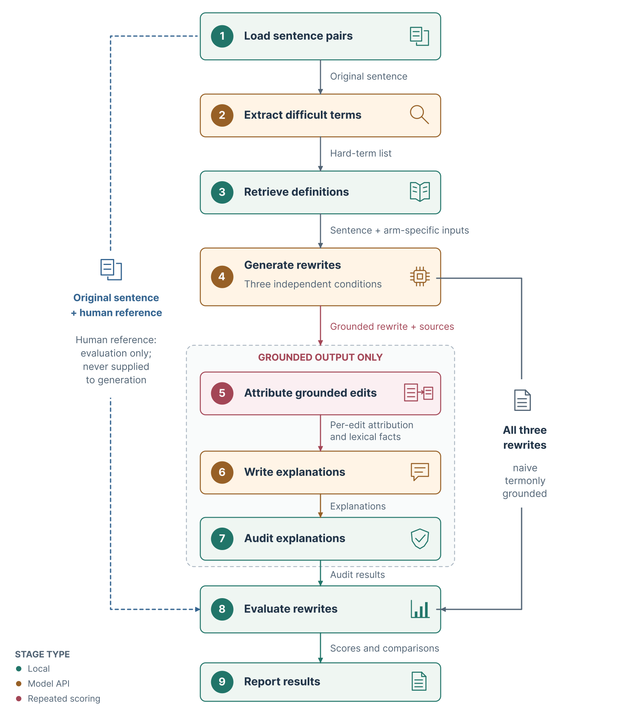

# Study I – Pipeline evaluation

Definition-grounded simplification of clinical sentences with per-edit source attribution
(ContextCite) and audited explanations. Six LLMs rewrote 100 Laymaker sentences under three prompts
(*naive*, *termonly*, *grounded*); all outputs of that run are included.

**Try the pipeline:** https://huggingface.co/spaces/xota1999/MedPlain

## Pipeline

<p align="center"></p>

| Stage | What it does | Code | API |
|---|---|---|---|
| 1 Load | 100 sentences and clinician references | `stages/s1_dataset.py` | – |
| 2 Extract | difficult terms (DeepSeek V4 Flash) + rule-based sanitiser | `stages/s2_extract.py` | Novita |
| 3 Retrieve | definitions from the local knowledge base (`data/`) | `stages/s3_retrieve.py` | – |
| 4 Generate | naive / termonly / grounded rewrites, edit tagging | `stages/s4_generate.py`, `stages/prompts.py` | Together, Fireworks, Novita |
| 5 Attribute | ContextCite on the grounded edits | `core/contextcite.py` | Together, Fireworks |
| 6–7 Explain, audit | one explanation per edit, checked against the facts it was given | `stages/s6_rationalize.py` | Together, Fireworks |
| 8 Evaluate | human-edit recall, readability, NLI, high-risk checks, attribution metrics | `stages/s5_evaluate.py`, `metrics/` | – |
| 9 Report | per-model reports and cross-model summary | `stages/s9_report.py` | – |

`run.py` runs all stages. `config.py` holds the six model deployments and every setting
(temperature 0, max. 512 new tokens, 32 + 32 ContextCite masks, at most 16 glossary entries, seed 1234).

## Setup

```bash
cd Study_I
pip install -r requirements.txt        # Python 3.11; pick the torch build for your machine at pytorch.org
```

**Models for BERTScore and NLI** (not included) – download them into these two folders:

```bash
hf download FacebookAI/roberta-large      --include "*.json" "*.txt" "model.safetensors" --local-dir roberta-large
hf download FacebookAI/roberta-large-mnli --include "*.json" "*.txt" "model.safetensors" --local-dir roberta-large-mnli
```

Sources: [roberta-large](https://huggingface.co/FacebookAI/roberta-large),
[roberta-large-mnli](https://huggingface.co/FacebookAI/roberta-large-mnli).
Without them these metrics are skipped (`--no-torch` turns them off explicitly).

**API keys** (only for new runs) – environment variables `TOGETHER_API_KEY`, `FIREWORKS_API_KEY`,
`NOVITA_API_KEY`, or the key on the first line of `keys/togetherAI_KEY`, `keys/firework.txt`,
`keys/novita.txt`.

## Knowledge base

| File in `data/` | Resource | Included | Licence |
|---|---|---|---|
| `laymaker_grade3_plain.json`, `laymaker.json` | [Laymaker](https://github.com/babylonhealth/laymaker) sentences and references | yes | CC BY 4.0 |
| `nih.json` | [NCI Dictionary of Cancer Terms](https://www.cancer.gov/publications/dictionaries/cancer-terms/) | yes | public domain |
| `thesarus.json` | [CDC Plain Language Thesaurus](https://stacks.cdc.gov/view/cdc/11500) | yes | public domain |
| `dictonary.csv` | [Webster's 1913 (OPTED)](https://github.com/CloudBytes-Academy/English-Dictionary-Open-Source) | yes | public domain |
| `wiktionary.json` | [Simple English Wiktionary via Kaikki](https://kaikki.org/simplewiktionary/) | yes | CC BY-SA / GFDL |
| `readme_exp_good.jsonl` | [README lay definitions](https://aclanthology.org/2024.findings-emnlp.737/) (Yao et al., 2024) | yes | CC BY-NC 4.0 |
| `Iowa.json` | [Iowa Medical Terms in Lay Language](https://hso.research.uiowa.edu/get-started/guides-and-standard-operating-procedures-sops/medical-terms-lay-language) | yes | used with permission of the University of Iowa and the University of Kentucky |
| `en.aoa.csv` | [Age-of-acquisition norms](https://doi.org/10.3758/s13428-012-0210-4) (Kuperman et al., 2012) | yes | openly published research norms |
| `dorland_medical_abbreviations.csv` | [Dorland's Dictionary of Medical Acronyms and Abbreviations](https://shop.elsevier.com/books/dorlands-dictionary-of-medical-acronyms-and-abbreviations/dorland/978-0-323-34020-5) | no | © Elsevier |
| `justplainclear_en_clean.json` | [Just Plain Clear](https://www.justplainclear.com/en) | no | © UnitedHealth Group |
| `michigan_plmd.json` | [Michigan Plain Language Medical Dictionary](https://github.com/mlibrary/medical-dictionary) | no | © Regents of the University of Michigan |

The three files marked *no* are not redistributed (no open licence or permission for public release).
The pipeline skips missing files with a warning, but the Stage 3 retrieval then differs for 65 of the
100 sentences; `--keep-retrieval` (see below) reuses the definitions saved from the reported run
instead. Own copies go under the names above (JSON: list of `{"term": ..., "definition": ...}`;
Dorland: CSV `term,candidate_id,candidate,num_candidates_for_term`); with files matching the SHA-256 in
`glossary_manifest.json`, Stage 3 reproduces the saved retrieval exactly. `tools/` contains the
preparation scripts (their raw inputs go in `data/archive/`).

## Reproduce

**From the saved outputs (no API calls):**

```bash
python analysis/focused_paper_statistics.py runs/run100_20260815_222318
python analysis/exclude_diagnostic_check.py runs/run100_20260815_222318 --output-prefix runs/diagnostic_check_exclusion
python tools/build_thesis_figures.py
```

The second command reproduces the high-risk rates and paired tests reported in the thesis
(the diagnostic-identity check is excluded from the high-risk rate); `SUMMARY.md`, `evaluation.json`
and the first command use the original definition.

**New run (paid API calls; hosted models do not return identical text):**

```bash
python run.py --preset audit5 --no-contextcite        # 5-sentence smoke test
python run.py --preset full100 --keep-retrieval       # all six models -> runs/run100_<timestamp>/
python tools/judge_replacements.py runs/run100_<timestamp>
python analysis/focused_paper_statistics.py runs/run100_<timestamp> --write
```

`run.py` reuses the extracted terms in `runs/_shared/`. `--keep-retrieval` also reuses their saved
definitions, i.e. the exact Stage 2–3 input of the reported run; without it Stage 3 runs again and
overwrites `runs/_shared/` (`git checkout runs/_shared` restores it). `--fresh-shared` extracts again;
the reported run used `--fresh-shared --extract-stability --no-cache`.

## Saved outputs

`runs/run100_20260815_222318/` is the run reported in the thesis (100 sentences × 3 arms × 6 models):

| File | Content |
|---|---|
| `manifest.json` | exact configuration, models and data provenance |
| `SUMMARY.md` | cross-model headline tables |
| `focused_paper_statistics.json` | paired tests with the original high-risk definition |
| `<model>/notes.json` | every sentence, arm, output, edit, ContextCite ablation and explanation |
| `<model>/evaluation.json` | all metrics: `aggregate` per arm, `attribution`, `rationale_audit`, ... |
| `<model>/replacement_judge.json` | LLM-judged replacement correctness and lexical overlap F1 |
| `<model>/report.md`, `detail.md`, `cost.txt`, `stage_log.txt` | readable report, per-note detail, API cost, log |

`runs/_shared/laymaker_100_deepseek-deepseek-v4-flash-0731/` holds the Stage 2–3 output used by all six
models, and `runs/diagnostic_check_exclusion.json` the revised high-risk analysis. The Ternary Bonsai
explanations in this run were regenerated with `tools/redo_rationales.py` (3,072-token budget).
