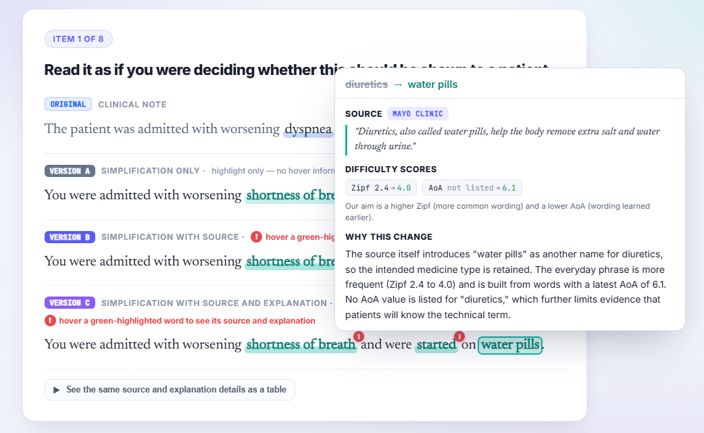
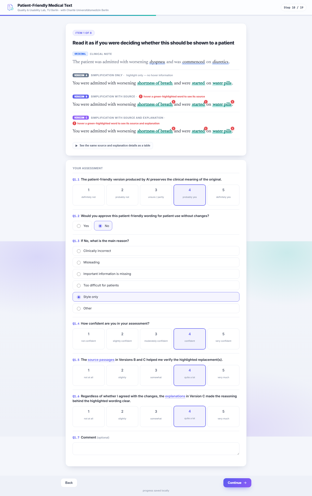

# Study II – Professional review study

Healthcare professionals reviewed eight fictional clinical sentences and their patient-friendly
rewrites. Each rewrite was shown in three versions on the same screen:

- **A** – replacements highlighted, no further information
- **B** – plus the source name and a supporting passage for each replacement
- **C** – plus Zipf and age-of-acquisition scores and a short explanation

<p align="center">
  <br>
  <sub>Item 1 with the version C popover open. Version B shows the same popover without scores and explanation.</sub>
</p>

Items 2, 4, 6 and 8 contain a planted error: in items 2 and 6 the passage contradicts the rewrite, in
items 4 and 8 passage and rewrite share the same false claim. The study ran on JATOS in English,
German and Albanian (28 July – 18 August 2026).

**Try it:** https://jatos.mindprobe.eu/publix/8PkhiTe7yVz – type `klp` (outside a text field) to show
a *Skip screen* button and click through the questions.

## Folder

```
study/          JATOS component: index.html, study.js (flow, stimuli, logging), locales.js (translations), style.css, images/
build_jzip.py   packs study/ into a JATOS archive
dist/           medplain_user_study_01.jzip, ready to import
data/           anonymised responses, one JSON object per participant
analysis/       scripts that produce the reported results and figures
docs/           screenshots shown in this README
```

## Run the study

- **JATOS:** *Import Study* and select `dist/medplain_user_study_01.jzip`. After editing `study/`,
  rebuild the archive with `python build_jzip.py`.
- **Locally:** `python -m http.server 8000 -d study`, then open http://localhost:8000. Without JATOS,
  answers stay in the browser and can be downloaded on the last screen.
- The skip shortcut is controlled by `SUPERVISOR_PREVIEW` at the top of `study/study.js`.

## Data

42 participants completed the study. After the screening described in the thesis:

| Folder | Participants | Used in |
|---|---|---|
| `data/*.txt` | 27 retained | all analyses |
| `data/borderline/` | 7 borderline | primary sample (N = 34) and unfiltered set |
| `data/excluded/` | 8 excluded | unfiltered set (N = 42) only |

Files were renamed to `user_01` … `user_42`. JATOS result IDs, run IDs and browser user-agent strings
were removed; everything else is the result data as recorded.
`meta.copyId` is the distribution link a participant used. Per item, `items["1".."8"]` stores the
answers `q` (Q1 meaning preservation 1–5, Q2 approval yes/no, Q3 reason for rejection, Q4 confidence 1–5,
Q5 sources helpful 1–5, Q6 explanations clear 1–5, Q7 comment), the time to each first answer
(`qTimesMs`) and every popover opening per replacement and version (`hovers`). The exact question
wording is in `study/locales.js`.

<details>
<summary>Screenshot: full item screen with the questions</summary>
<p align="center"></p>
</details>

## Analysis

```bash
pip install -r requirements.txt
python analysis/robust_stats.py            # headline rates with participant-bootstrap CIs, GEE odds ratios
python analysis/analyse.py                 # descriptives, subgroups, explanation-length tests, correlations
python analysis/build_eval.py              # headline measures for the three inclusion sets
python analysis/build_thesis_figures.py    # thesis figures -> figures/thesis/
```

`analyse.py` and `robust_stats.py` use the primary sample by default; `--strict` (N = 27) and `--all`
(N = 42) switch to the other inclusion sets.
